# 宾语自动化快速使用

快速使用宾语自动化，请按照如下步骤执行。

## 下载

如果您是电脑用户，请安装python环境和下载rwmapeditor-exgcdwu。网络教程有很多（至少比我懂），不再赘述。

如果您是手机用户，推荐使用Termux应用来进行宾语自动化。接下来是安装步骤。

首先是下载Termux应用。

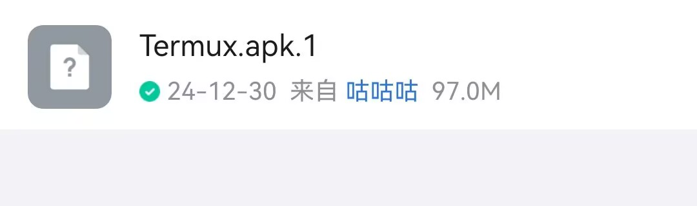

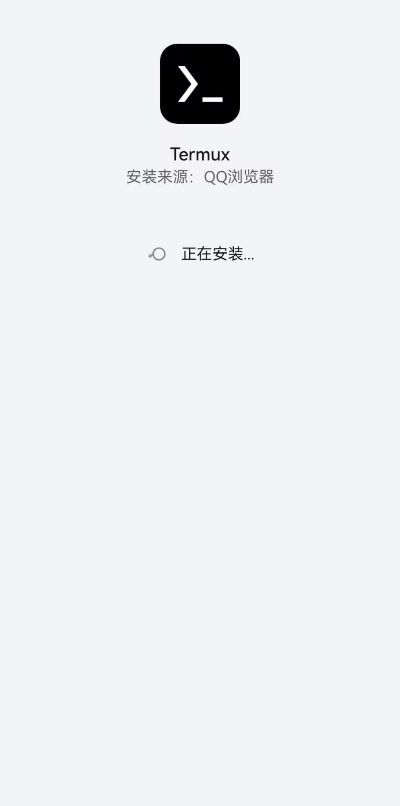

然后进入Termux，你会看到这样一个对话框。

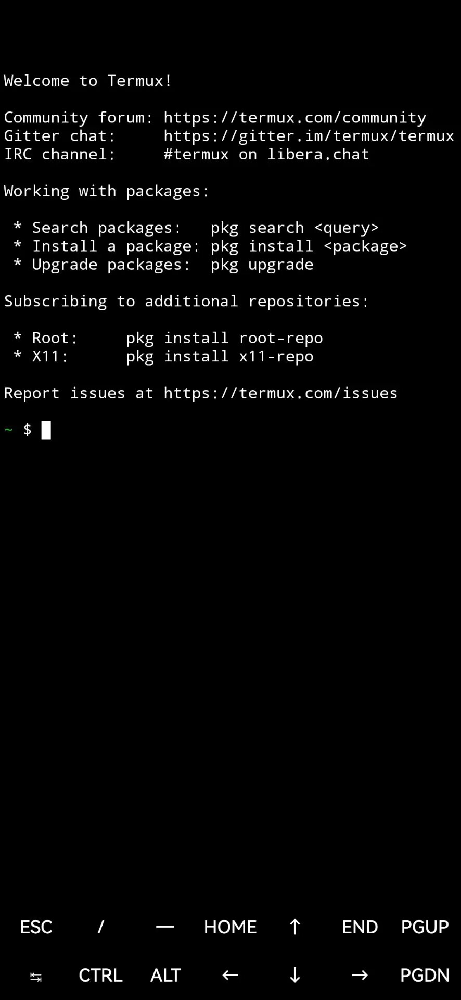

接下来我们的操作都会在这里进行。

然后，我们输入

    pkg update -y

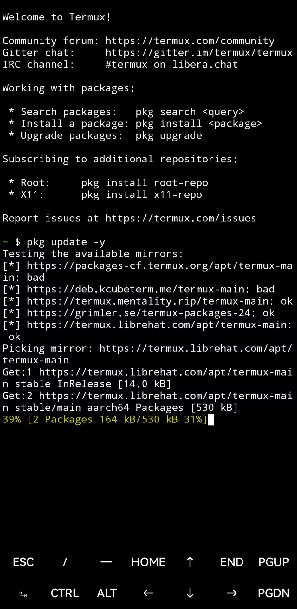

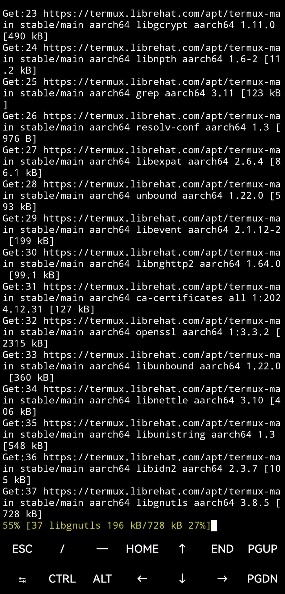

这一步要花些时间（十几分钟），请保持网络畅通。可以划屏先干别的。

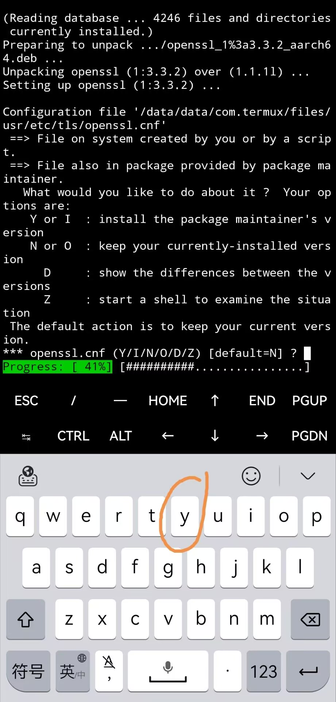

如果看到有类似于这样询问是否继续的问题，请输入y再回车。

然后继续安装。

    pkg install -y python
    pkg install -y python-numpy
    pkg install -y python-pillow

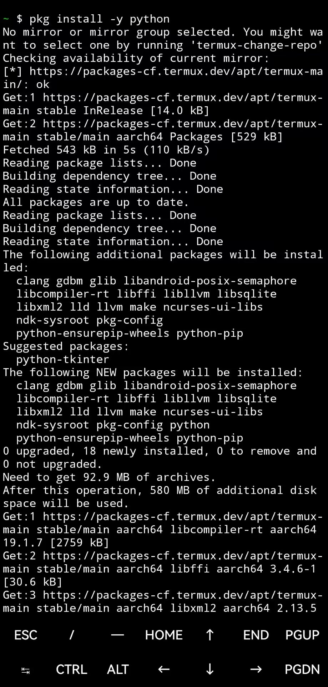

至此，python和重要的库安装完毕。

下一步是重定向python库安装的网站，以提高速度。

    pip config set global.index-url https://pypi.tuna.tsinghua.edu.cn/simple #（如果清华镜像不可以，换成别的镜像比如https://pypi.mirrors.ustc.edu.cn/simple 也行）

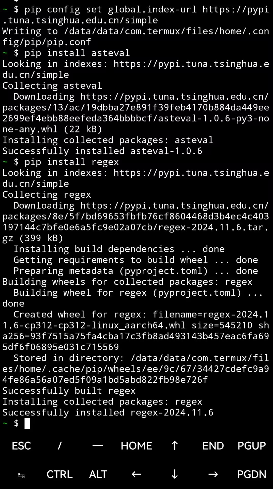

接下来将与宾语自动化相关的库全部安装。

    pip install asteval
    pip install regex # 1.6.3新加入
    pip install pybind11 # 1.8.0新加入
    pip install imageio # 1.8.0新加入
    pip install sortedcontainers # 1.8.0新加入
    pip install networkx # 1.8.5 新加入

安装铁锈地图自动化库。

    pip install rwmapeditor-exgcdwu==1.8.7 --no-deps # 这个版本号("1.8.7")填入目前最新的版本号。

为了能从手机中读取写入文件，继续。

    termux-setup-storage

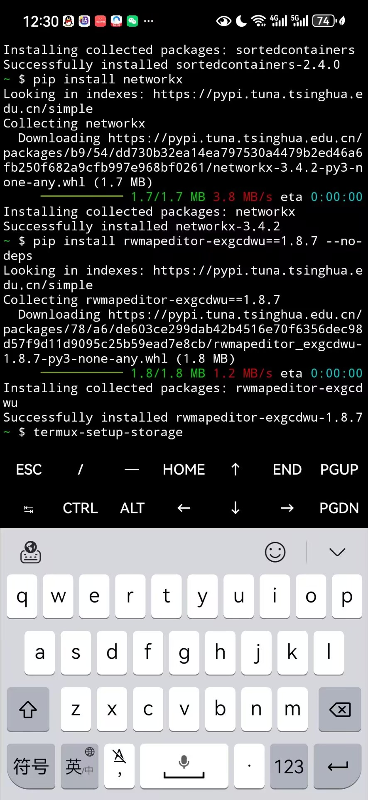

然后点同意获取读取存储权限。

之后也可以更新版本，比如:

    pip install rwmapeditor-exgcdwu==1.6.1 --no-deps # 新版本(1.6.1其实不新，举个例子)

之后，我们就可以在Termux上实现宾语自动化了。

## 模版导入

如果您是电脑用户，请打开Tiled，并将宾语自动化模板复制进入你的地图。相信您能完成后续的操作。强烈建议在电脑上复制宾语自动化的模板。

    创建您的新地图

    创建Triggers触发层

    将"宾语自动化例子"文件中所有"info"宾语以及"dd.d"或者形如"ddx.dx"(x是一个不同的字母)的宾语复制粘贴进您的地图(Trigger)。以及fi,fd,si宾语复制粘贴进入（这些宾语不得与其他宾语重合，应当在地图外。）

如果您是手机用户，接下来将会介绍如何联合使用notTiled（地图编辑器）、mt浏览器(铁锈地图制作非常常用)和Termux完成宾语自动化。

首先在notTiled中新建一个地图。并将其导出。

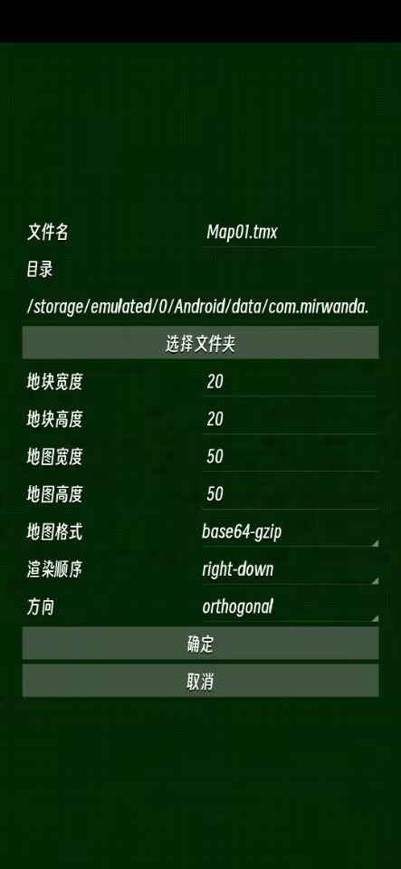

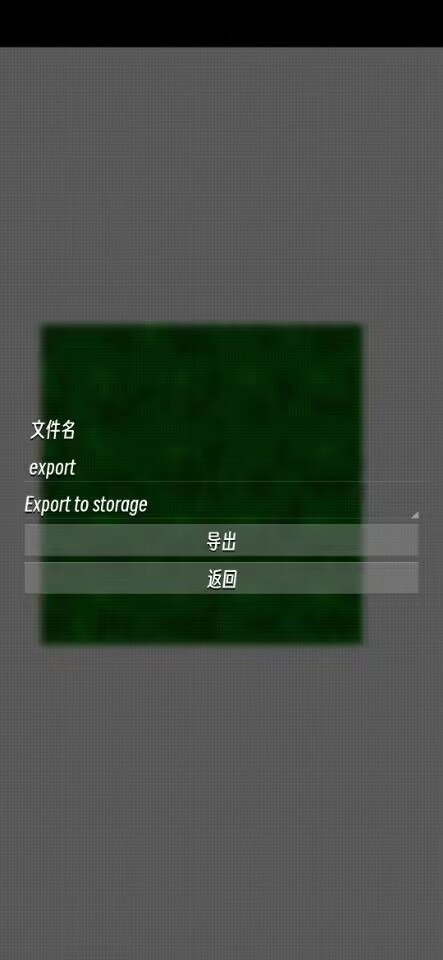

在mt浏览器中用文本模式打开"宾语自动化例子"，搜索Triggers。将整个objectgroup复制下来。

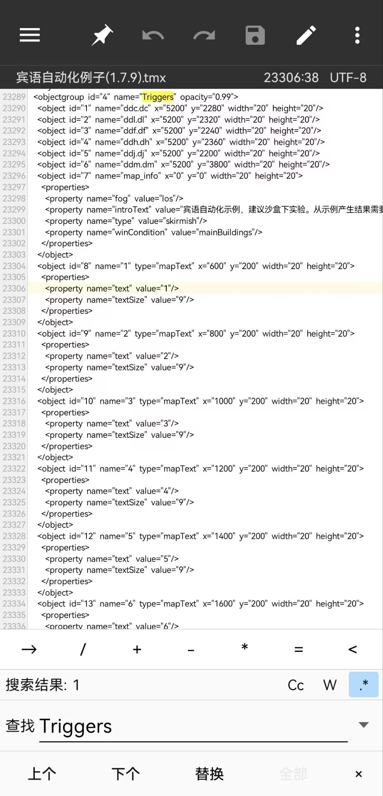

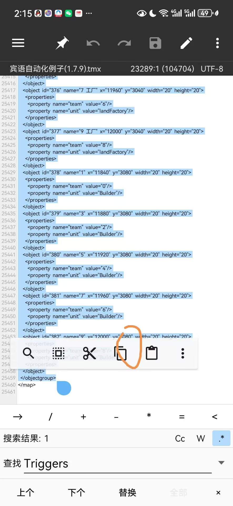

然后在mt浏览器中用文本模式打开您的地图，在\<\/map\>末尾之前将复制的内容粘贴。

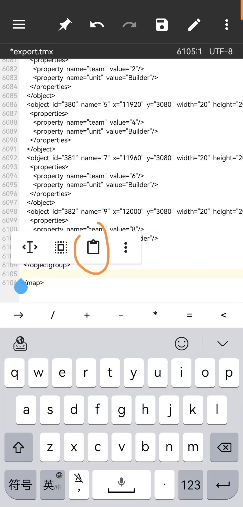

如此，您已经将宾语自动化模板复制完毕。再将这张地图导入notTiled中。

然而，这些info的位置没有移动，而且还有很多无关的宾语存在，请将它们删除（在mt中）。保证，只有"info"宾语以及"dd.d"或者形如"ddx.dx"(x是一个不同的字母)的宾语。

并且有必要将fi,fd,si宾语位置进行移动，它们之间不能重合，也应当在地图外部。

这一过程在mt浏览器或者notTiled中做十分繁琐，强烈建议在电脑Tiled中将模板移动过去，书写宾语也在电脑上完成。

## 标记宾语书写

请参照"宾语自动化示例说明"进行。
